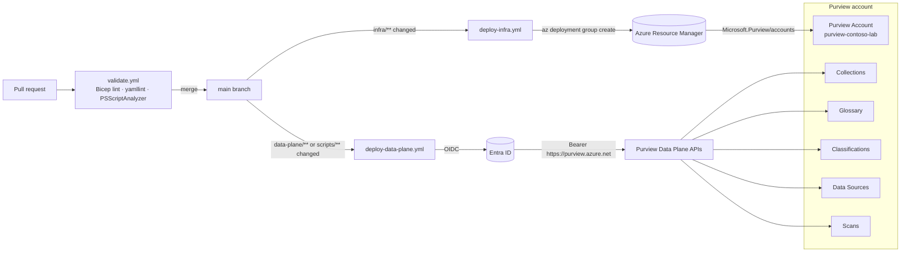

# Architecture

## Two-plane model

## Why this shape

- **Account name is identity.** The Purview account name is the DNS hostname of the data plane (`<name>.purview.azure.com`) and the name of the root collection. Renaming is effectively a rebuild; IaC treats it as a fixed input.
- **Data plane is not in ARM.** Collections, glossary, classifications, sources, and scans are invisible to Bicep/Terraform. They live behind the Atlas v2 / Purview scan / Purview account REST APIs. That is why this repo ships PowerShell helpers driven by YAML manifests.
- **OIDC > client secret.** The federated credential on the Entra app lets GitHub Actions obtain short-lived tokens for both `https://management.azure.com` (ARM) and `https://purview.azure.net` (data plane) with no stored secret.
- **Idempotent upserts.** Each script resolves current state and issues PUTs. Deletes are deliberately opt-in to prevent a mis-merged PR from dropping production collections.

## Endpoints & API versions

| Concern | Endpoint | API version |
|---|---|---|
| Account / collections | `https://<acct>.purview.azure.com/account` | `2019-11-01-preview` |
| Atlas (glossary, typedefs, entities) | `https://<acct>.purview.azure.com/datamap/api/atlas/v2` | Atlas v2 |
| Scanning (sources, scans, rulesets) | `https://<acct>.purview.azure.com/scan` | `2022-02-01-preview` |

> [!NOTE]
> The DevOps / data-owner policies surface (`https://<acct>.purview.azure.com/policystore`, `2022-08-01-preview`) is **no longer managed by this repo**. Its reconciler was retired per [ADR 0038](adr/0038-devops-policies-reconciler-retirement.md) — the surface is in classic customer-support mode with documentation mirrored under `/purview/legacy/` and no GA `api-version`.

References: [Purview REST API index](https://learn.microsoft.com/en-us/rest/api/purview/), [Microsoft.Purview/accounts Bicep](https://learn.microsoft.com/en-us/azure/templates/microsoft.purview/accounts).

## Reference patterns adopted from `Azure-Deployment-Pipelines`

The reference repo (`Azure-Deployment-Pipelines/Purview/`) ships three working solutions today: `Purview-AutoLabel-Policy`, `Bulk-Sensitivity-Label-Change-M365`, and `SIT-Confidence-Analysis` (sister repo; paths are workspace-local on the lab owner's machine, not navigable from this repo). Patterns worth porting, with this repo's translation:

| Reference repo pattern | This repo's translation |
|---|---|
| `ExchangeOnlineManagement` v3.0+ with `Connect-IPPSSession` for Security & Compliance Center cmdlets | Same module, same cmdlet. Add `Connect-ComplianceCenter.ps1` helper alongside [`scripts/Connect-Purview.ps1`](../scripts/Connect-Purview.ps1). |
| App-only cert-in-Key-Vault auth for unattended runs | Same pattern. Certificate issued into the existing lab Key Vault, federated to the GitHub Actions workload identity per [Use Azure Login with OpenID Connect](https://learn.microsoft.com/en-us/azure/developer/github/connect-from-azure-openid-connect). |
| Three policy modes: `TestWithoutNotifications` → `TestWithNotifications` → `Enable` | Preserved verbatim in `data-plane/information-protection/auto-label-policies.yaml` as `mode:`. Default in new files is `TestWithoutNotifications`. |
| Three confidence tiers: Low (≤65%) / Medium (66–84%) / High (85–100%) | Preserved. Encoded as `confidenceLevel:` on each SIT reference. See [Sensitive information type confidence levels](https://learn.microsoft.com/en-us/purview/sensitive-information-type-learn-about#more-information-on-confidence-levels). |
| SIT identity by GUID (for example, `a44669fe-0d48-453d-a9b1-2cc83f2cba77` for U.S. SSN) | Preserved. GUIDs live in `data-plane/classifications/sit-catalog.yaml` with a human-readable `displayName:` beside each one. |
| `params.json` per-solution config file | Translated to YAML (`solution.yaml` + `*.params.yaml`) to match [`.github/instructions/data-plane-yaml.instructions.md`](../.github/instructions/data-plane-yaml.instructions.md). JSON is not a first-class format here. |
| Azure DevOps pipelines with service connections | Translated to GitHub Actions with OIDC federated credentials. Same outcome, different CI. |
| Content Explorer CSV export as the confidence-analysis data source (not Data Explorer) | Preserved as guidance in the DSPM/analysis wave. |
| Windows PowerShell 5.1 requirement for WAM | **Not adopted.** This repo mandates pwsh 7.4+ per [`.github/instructions/powershell.instructions.md`](../.github/instructions/powershell.instructions.md). Any cmdlet that truly requires 5.1 is called out in an ADR or avoided. |

## Sensitivity label protection model

Each encrypted sublabel in [`data-plane/information-protection/labels.yaml`](../data-plane/information-protection/labels.yaml) declares a `protectionType:` value (`Template`, `UserDefined`, or `RemoveProtection`). The choice is a deliberate security-posture trade-off; flipping it changes both the runtime behavior and the Microsoft Purview portal UX. The repo default is `UserDefined`.

| `protectionType:` | Permissions source | UI "Assign permissions" editor | When to choose |
|---|---|---|---|
| `Template` | Permissions are baked into the label and applied identically every time the label is set. | Grayed out in the Purview portal — users and admins cannot adjust per-document permissions. | High-assurance scenarios where the permission set must be uniform, auditable, and immune to user error (regulated data, compliance-driven access controls). |
| `UserDefined` | Permissions are chosen at apply time by the labeller (user or admin) within the bounds the label allows. | Available in the Purview portal — permissions can be set per document. | Day-to-day collaboration where the labeller needs flexibility (sharing specific files with named partners, ad-hoc external recipients). |
| `RemoveProtection` | No encryption applied; any prior encryption is stripped. | Not applicable. | Down-classification flows and explicit "unprotect" sublabels. |

Switching between `Template` and `UserDefined` is a YAML edit followed by a reconciler apply (`./scripts/Deploy-Labels.ps1`). It is reversible at any time. Re-evaluate the choice during any review that touches label scope, audience, or compliance posture. References: [Set-Label cmdlet](https://learn.microsoft.com/en-us/powershell/module/exchange/set-label), [Configure usage rights for Azure Information Protection](https://learn.microsoft.com/en-us/azure/information-protection/configure-usage-rights).

### Applying label changes via CI

Sensitivity labels are reconciled by the `Deploy sensitivity labels` step in the [`deploy-data-plane`](../.github/workflows/deploy-data-plane.yml) workflow. The workflow is manual-dispatch only (`workflow_dispatch`), and the labels step shares the same Key Vault firewall open/close window as the role-groups step so the vault returns to `publicNetworkAccess: Disabled` after every run.

Dispatch procedure:

1. Open the workflow in the GitHub Actions UI: **Actions → deploy-data-plane → Run workflow**.
2. Choose inputs:
   - `plan_labels_only: true` — runs `Deploy-Labels.ps1 -WhatIf`. No `Set-Label` calls; produces the plan table only. Use this first whenever the YAML has changed since the last apply.
   - `plan_labels_only: false` (default) — runs `Deploy-Labels.ps1` for a live apply against the lab tenant.
   - `prune_role_groups`: leave `false` unless the dispatch is specifically reconciling role-group drift; it does not affect labels.
3. Confirm the run targets the `lab` environment and the `feat/...` or `main` ref you expect.
4. After completion, inspect the `Deploy sensitivity labels` step log for the reconciler plan table and any `WARNING` rows (for example, the documented `autoApplicationOf` create-path gap).

Who can dispatch: anyone with `write` access to the repo can dispatch, but the dispatch flows through the `lab` GitHub environment which is owner-gated. The data-plane workload identity (`gh-oidc-purview-data-plane`) is the principal that mutates labels; portal UI changes by humans require membership in `sg-purview-information-protection-admins`.
